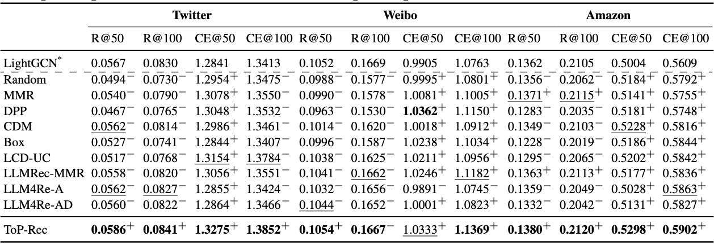
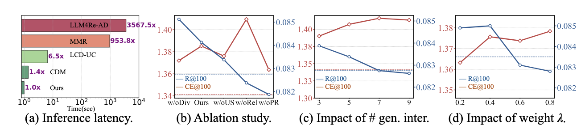

<h1 align="center">Tree of Preferences for Diversified Recommendation</h1>
<!-- <p align="center" style="font-size: 30px;">
  <b>Training VLM agents with multi-turn reinforcement learning</b>
</p>
<p align="center" style="font-size: 10px;">
  <b>NeurIPS 2025</b>
</p> -->


<div  align="center">    

</div>

Illustration of our approach: **T**ree **o**f **P**references for diversified **Rec**ommendation (ToP-Rec). Given *Alice* with her attributes and interacted items, ToP-Rec infers her rationale along the constructed ToP by prompting LLMs to comprehensively uncover her preferences until reaching the leaf nodes. Items aligned with her preferences are then matched, and synthesized user-item interactions concerning diversity and relevance are generated and integrated with the observed interactions. The combined data enables the recommender to offer diversified suggestions.

## News
**[2025/09]** Our paper is accepted by Neurips 2025 as poster! 🎉

## Datasets

Original datasets used in this work are downloaded from following URLs: \
Twitter: https://github.com/LuoUndergradXJTU/TwiBot-22 \
Weibo: https://www.aminer.cn/influencelocality \
Amazon: https://amazon-reviews-2023.github.io/ \
We follow [1] to preprocess these datasets, which can be found in `datasets/`.

## File architecture
- `ToP/`: ToP construction and recommendation framework
- `dataset/`: dataset.
- `weights/`: weights for the best recommender models during the training process.
- `model/`:  main code for ToP-Rec.
  - `main.py`: code framework for training the recommender models with ToP data augmentation. 

We provide a demo, running the proposed ToP-Rec with lightgcn backbone on the twitter dataset.

## Installation
```shell
conda create -n ToPRec python=3.10 -y
conda activate ToPRec

git clone https://github.com/downing777/TPRec.git
pip install -r requirements.txt
```
## Usage
```shell
#To infer with the saved recommender, run:
PYTHONPATH=. python model/main.py --n_epochs 0 

# To construct ToP for twitter:
bash tree_construction.sh

# To full train a recommender with dynamic ToP augmentation:
bash main.sh
```


## Main results
<div  align="center">    

</div>
Comparison of performance on diversity (R@k) and relevance (CE@k). * denotes the backbone model, and +/- indicates performance improvements or declines compared to the backbone. The optimal performance is in bold, and the suboptimal performance is underlined.

<div  align="center">    

</div>
(a) Comparison of average time to generate recommendations; (b) Evaluation of each component in ToP-Rec; (c) and (d) Impact of generated interactions per user and selection weight $\lambda$. We use dashed lines to represent the performance of the backbone recommender.

## Reference
  
[1] Yu Zheng et al. “DGCN: Diversified recommendation with graph convolutional networks”. In:184
Proceedings of the web conference 2021. 2021, pp. 401–412.185